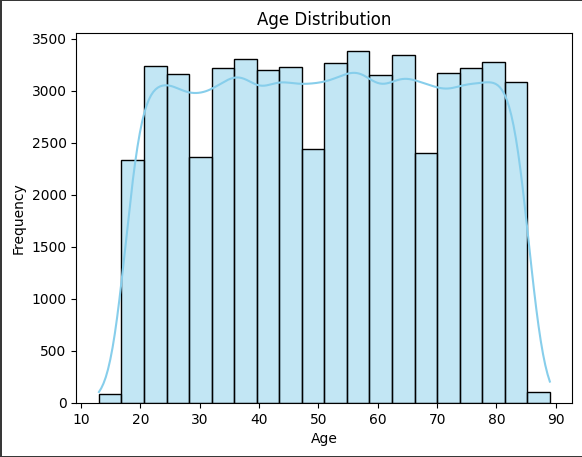
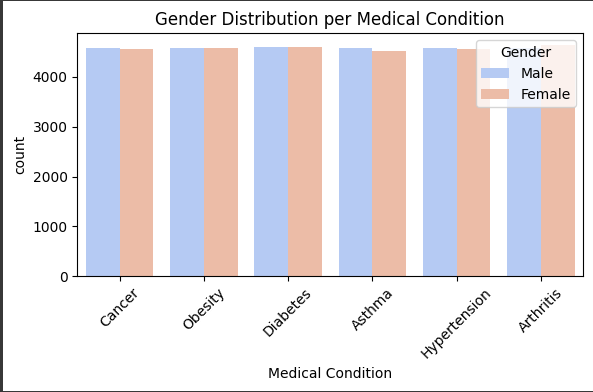

# Healthcare Data Analysis 🏥

This repository contains the **first stage** of analyzing a Healthcare Dataset.  
In this phase, I focused on **data cleaning, preprocessing, exploratory data analysis (EDA), and visualizations**.

---

## 🔹 Steps Completed
- **Data Cleaning & Preprocessing**
  - Converted admission and discharge dates into datetime format.
  - Removed duplicate records.
  - Dropped irrelevant columns (e.g., Room Number).
- **Exploratory Data Analysis (EDA)**
  - Checked data types, missing values, and unique categorical values.
  - Calculated descriptive statistics (min, max, distributions).
- **Visualizations**
  - Age distribution.
  - Test Results distribution.
  - Age vs Test Results (boxplot).
  - Age distribution by Gender.
  - Gender distribution per Medical Condition.
  - Blood Type by Medical Condition.
  - Average Billing Amount per Medical Condition & Insurance.
  - Medical Condition vs Admission Type, Test Results, and Medications.

---

## 📸 Example Visualizations
  

---

## 🚀 Tools & Libraries
- Python (Pandas, NumPy)
- Matplotlib, Seaborn
- Jupyter Notebook

---

✍️ **Author:** [Nada Elsayed]  
🔗 Connect with me on [LinkedIn]([your-linkedin-profile](https://www.linkedin.com/in/nada-elsayed-7a2057331/)
